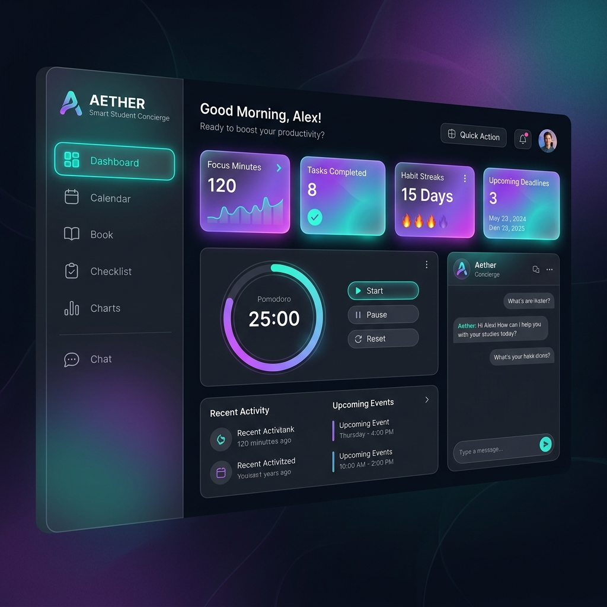

<div align="center">



# ✨ Aether — Smart Student Concierge Agent

### AI-Powered Personal Study Assistant

[](https://developer.mozilla.org/en-US/docs/Web/HTML)
[](https://developer.mozilla.org/en-US/docs/Web/CSS)
[](https://developer.mozilla.org/en-US/docs/Web/JavaScript)
[](https://developer.mozilla.org/en-US/docs/Web/API/Web_Audio_API)
[](https://developer.mozilla.org/en-US/docs/Web/API/Window/localStorage)

**Aether** is a premium, zero-dependency, browser-based AI study companion designed for students who demand focus, organization, and intelligence — all in one sleek glassmorphic dashboard.

[🚀 Live Demo](#-getting-started) · [📸 Screenshots](#-screenshots) · [✨ Features](#-features) · [🛠️ Tech Stack](#️-tech-stack)

</div>

---

## 📸 Screenshots

<div align="center">

| 🏠 Dashboard | 🤖 AI Concierge |
|:---:|:---:|
|  |  |

| ⏱️ Focus Hub | 📊 Analytics & GPA |
|:---:|:---:|
|  |  |

</div>

---

## ✨ Features

### 🏠 Smart Dashboard
- **Live Stats Panel** — Real-time tracking of focus minutes, tasks completed, habit streaks, and upcoming deadlines
- **Daily Motivational Quotes** — Curated wisdom to keep you inspired every session
- **Study Tip Widget** — Randomly surfaces evidence-based study techniques
- **Pomodoro Quick Widget** — Start a focus timer directly from the dashboard

### 🤖 AI Concierge Chat
- **Academic Knowledge Base** — Ask Aether to explain Physics, Mathematics, Biology, Computer Science, and History concepts
- **Smart Study Schedule Generator** — Request a personalized study plan and get a full day-by-day schedule instantly
- **Voice Commands via Text** — Type `remind me to [task]` and Aether adds it to your Task Board automatically
- **Quick Note Creation** — Type `note down [title]: [content]` and Aether saves it to your Notes tab
- **Context-Aware Responses** — Intelligent intent parsing for academic topics, tips, and scheduling requests

### ⏱️ Focus Hub (Pomodoro Timer)
- **Circular SVG Progress Ring** — Smooth animated countdown with a gradient teal-to-violet stroke
- **3 Timer Modes** — Pomodoro (25m), Short Break (5m), Long Break (15m)
- **Fully Customizable Intervals** — Set your own focus durations per session
- **Web Audio API Alarm** — Procedural audio chime plays when your session ends
- **Focus Stats Sync** — Completed sessions automatically log into the Weekly Analytics chart

### 🎧 Focus Soundscapes *(Browser-native, no files needed!)*
- **🌧️ Rain Shower** — Procedural brown-noise rain with lowpass filter
- **📻 White Noise** — Pure white noise for distraction blocking
- **☕ Cafe Ambiance** — Layered bandpass rumble with a soft bass drone
- **🎵 Focus Humming** — Warm triangle+sawtooth drone with LFO modulation for a vinyl-like warmth
- **Volume Control** — Live gain adjustment without any interruptions

### ✅ Task Board
- **Kanban-style Columns** — "To Do" and "Completed" columns with animated card transitions
- **Priority Tagging** — High / Medium / Low badges with color-coded indicators
- **Category Labels** — Homework, Project, Exam, and Personal task types
- **Quick Filters** — Filter by All, Pending, Completed, or High Priority in one click
- **Cross-tab Sync** — Dashboard instantly reflects task board changes

### 📓 Notes & Deadlines
- **Rich Note Cards** — Two-column masonry-style layout with tag badges and dates
- **Live Countdown Timers** — Real-time ticking countdowns for every tracked deadline (`3d 4h 22m 10s`)
- **Deadline Sorting** — Deadlines are auto-sorted by proximity in time
- **Persistent Storage** — All data saved across browser sessions via LocalStorage

### 📊 Analytics & GPA Calculator
- **Custom SVG Bar Chart** — Weekly focus sessions rendered as a dynamic gradient bar chart
- **Task Completion Rate** — Percentage of tasks completed shown as a summary stat
- **GPA Calculator** — Enter courses, grades (A–F), and credit units for an instant 4.0-scale GPA
- **Habit Tracker** — Daily checkbox habits with 🔥 streak counting per habit

---

## 🔁 Application Workflow

```
┌──────────────────────────────────────────────────────────────────┐
│                    AETHER — Application Flow                     │
└──────────────────────────────────────────────────────────────────┘

  User Opens App
        │
        ▼
  ┌─────────────┐        ┌──────────────────────────────────────┐
  │  Dashboard  │◄──────►│  LocalStorage (Tasks, Notes,         │
  │  (Home Tab) │        │  Habits, GPA, Focus Minutes)         │
  └──────┬──────┘        └──────────────────────────────────────┘
         │
         ├──► 🤖 AI Concierge Tab
         │         │
         │         ├── User types a query
         │         ├── Parser matches: topic / schedule / tip / command
         │         ├── Auto-creates Tasks or Notes if commanded
         │         └── Returns rich formatted academic response
         │
         ├──► ⏱️ Focus Hub Tab
         │         │
         │         ├── Select mode: Pomodoro / Short Break / Long Break
         │         ├── Customize intervals (1–120 min)
         │         ├── Play ambient soundscape (Rain / White Noise / Cafe / Lofi)
         │         ├── Animated SVG ring counts down
         │         └── On completion: alarm fires → logs focus stats → auto-switch mode
         │
         ├──► ✅ Task Board Tab
         │         │
         │         ├── Add tasks via modal (title, category, priority, deadline)
         │         ├── Toggle completion → synced to dashboard stats
         │         └── Filter by priority or status
         │
         ├──► 📓 Notes & Deadlines Tab
         │         │
         │         ├── Add notes (title, content, tag)
         │         ├── Add deadlines (title, datetime)
         │         └── Live countdowns update every second
         │
         └──► 📊 Analytics & GPA Tab
                   │
                   ├── SVG bar chart renders weekly focus data
                   ├── GPA auto-calculates as grades are entered
                   └── Habits toggle with streak tracking
```

---

## 🛠️ Tech Stack

| Technology | Usage |
|---|---|
| **HTML5** | Semantic structure, modals, forms, SVG timers |
| **Vanilla CSS3** | Glassmorphism, custom HSL design tokens, CSS Grid/Flexbox, animations |
| **Vanilla JavaScript (ES6+)** | State management, DOM manipulation, event delegation |
| **Web Audio API** | Procedural ambient soundscape synthesis (no audio files needed) |
| **SVG** | Circular progress ring, weekly bar chart analytics |
| **LocalStorage** | Full client-side persistence across browser sessions |
| **Google Fonts** | `Outfit` (headings) + `Inter` (body text) |
| **Lucide Icons** | Clean SVG icon set for navigation and UI elements |

---

## 📁 Project Structure

```
aether/
├── index.html        # Main app structure, modals, navigation panels
├── index.css         # Design system: tokens, glassmorphism, animations, responsive
├── app.js            # Core logic: state, timer, soundscapes, GPA, habits, AI bot
├── mockData.js       # Academic knowledge base, schedules, quotes, tips
├── assets/
│   └── banner.png    # Project banner image
└── README.md         # You are here!
```

---

## 🚀 Getting Started

No build tools, no npm, no dependencies. Just open it in a browser!

### Option 1 — Direct File Open
```bash
# Clone the repository
git clone https://github.com/vemulakondasaikumar2-beep/aether.git

# Open in browser
start aether/index.html
```

### Option 2 — Local Server (Recommended)
```bash
# Clone
git clone https://github.com/vemulakondasaikumar2-beep/aether.git
cd aether

# Run with Python
python -m http.server 8000

# OR with Node.js
npx serve .

# Open in browser
# http://localhost:8000
```
#demo link
https://vemulakondasaikumar2-beep.github.io/aether/
---

## 🤖 AI Concierge — Command Reference

| Command | What it does |
|---|---|
| `Explain gravity` | Returns a detailed Physics explanation |
| `What is photosynthesis?` | Returns a Biology breakdown |
| `Explain calculus` | Returns Differential & Integral overview |
| `Explain algorithms` | Returns Big-O notation reference |
| `Suggest a study schedule` | Returns a full multi-day study plan |
| `Give me a study tip` | Returns a random evidence-based study technique |
| `Remind me to [task name]` | **Auto-creates a task** on the Task Board |
| `Note down [title]: [content]` | **Auto-saves a note** in your Notes tab |

---

## 💡 Design Philosophy

Aether was built around three core principles:

1. **Zero Friction** — No sign-up, no API keys, no internet required after load. Open the file and you're productive.
2. **Science-Backed Productivity** — Features like Pomodoro timers, spaced repetition reminders, and habit streaks are grounded in cognitive science research.
3. **Premium Feel** — A student's tools should feel as polished as professional software. Glassmorphism, micro-animations, and typographic hierarchy create a workspace you *want* to spend time in.

---

## 📜 License

This project is open source and available under the [MIT License](LICENSE).

---

<div align="center">

**Built with ❤️ for students, by a student.**

⭐ Star this repo if Aether helped you study better!

</div>
